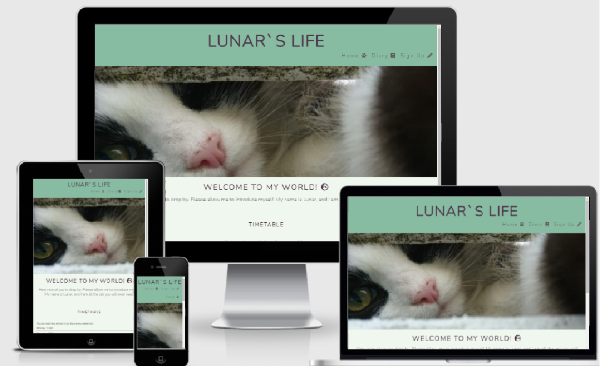
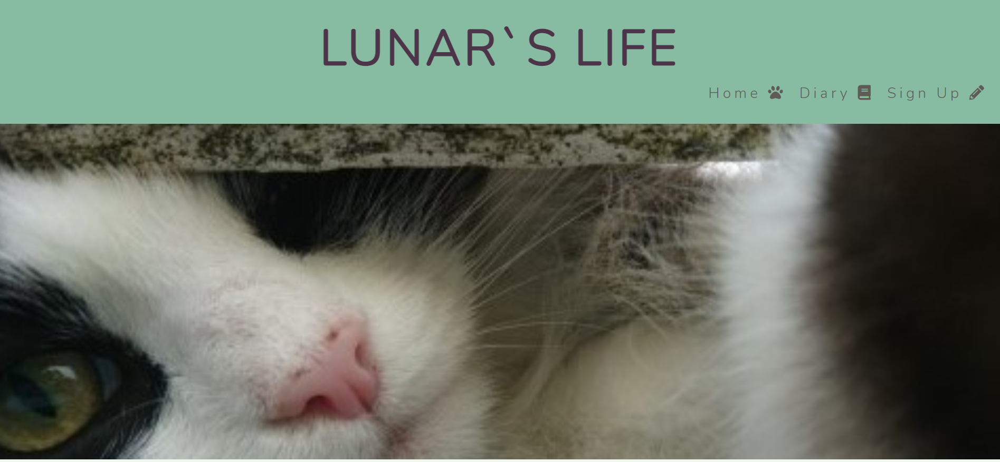
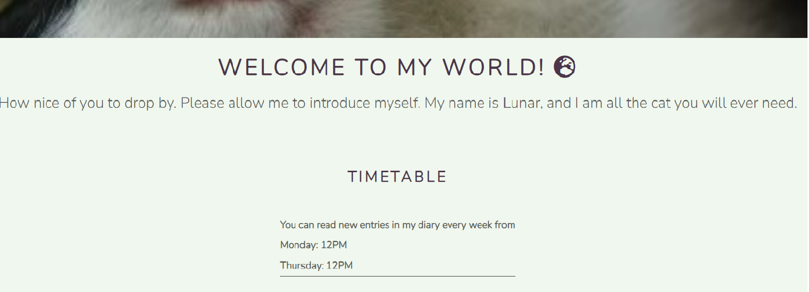
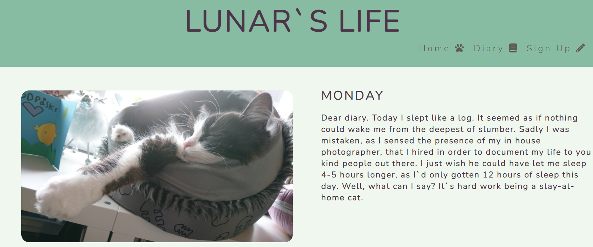
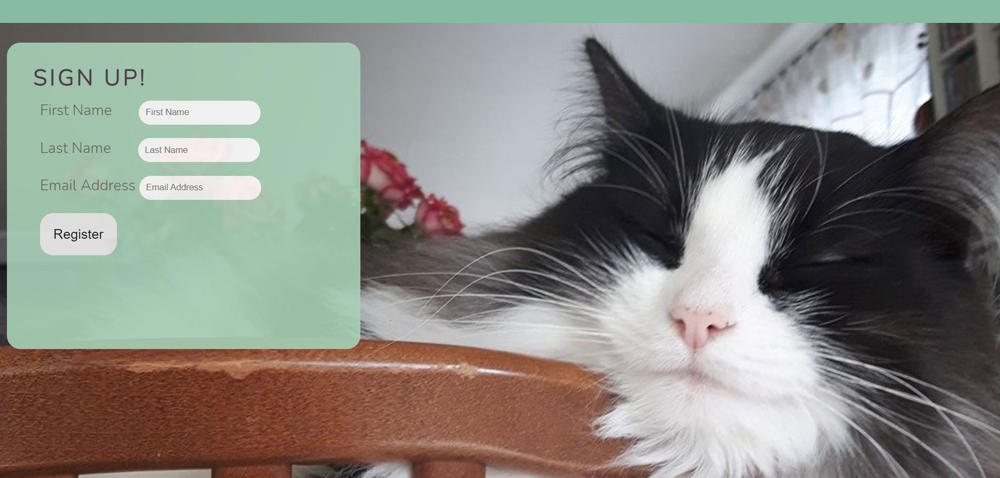
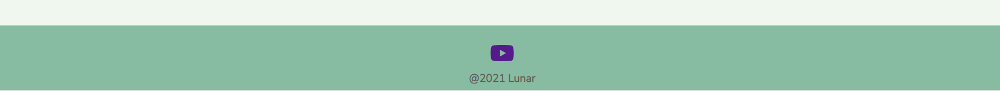
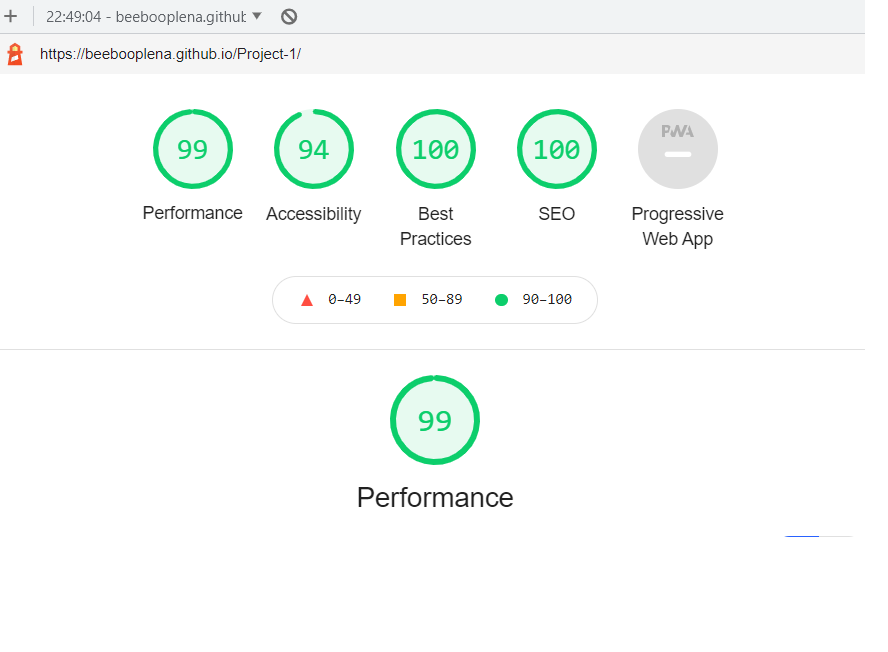

# Lunar`s life
This is a site where animal and cat lovers can follow and get updated about the cat Lunar. The written text is the "voice" of Lunar, that reflects over his happenings in his everyday life. This site is a place to give people humour, love and cute pictures of Lunar. Many people are drawned to cats and this site will give a lot of cuteness that people find in cats. Lunar is my own cat and as many cat lovers, I have a lot of pictures of my cat on my phone that I can easily use for Lunar`s site.

## Features
Top of the header is the logo and title Lunar`s life. Below the logo you will find a big close up picture of Lunar with a zooming effect, The picture will show the reader that this is about a cat. I choosed calm colours like light green to make it more nature and relaxing to the eye of the reader.

**Timetable**

Below the main image of Lunar you will find a welcome text from Lunar and a timetable to let the reader know when there are new entries in his diary.

**Diary page**

The diary page is where you can read Lunar`s diary, every monday and thursday. When the reader is reading the diary, it is the cat's voice we can read and not the owner.

**Sign-up page**

The sign-up page is where the reader can sign up to be updated when new entries are ready. The reader will see a big beautiful picture of Lunar. The form is on the top left of the picture with a little opacity effect on.

 **Footer**

The footer has a social media link to youtube in a new page, to show some videos of Lunar.

### Existing Features
**Navigation bar**

You can find the navigation bar at the top right of the screen. the navigation bar are on all three pages, at the same place with icons, to make it easy and convenient. The navigation bar has hoover css. 

## Testing 

* I have tested browsers like chrome and Microsoft edge to see if the webpage works nicely.

* I have used different screensizes by using devtools device toolbar to see if the webpage work responsive and look nice.

* I have checked if the form is working and that the register button is working. The form requiers an email and entries on first name and last name.

* I have checked that all the pages looks clean and are easy to understand. The text has an easy to read font.

* I have checked that the navigation bars are working and that the social media link on the footer works.

### Validator Testing 
**HTML**

* The offical W3C validator showed no errors when tested.

**CSS**

* The official Jigsaw validator showed no errors when tested.

**Accessibility**
* By using lighthouse in devtools I could see that the webpage scored very well on all the tests.

### Bugs
When I was working with my media queries, I found out that the css I used on my diary page by using top, right and bottom gave me very little control when I needed to change the media queries css for smaller screens. I wanted to have the picture and the text vertically lined when using mobile screens. I tried learning flex-box, but couldn`t make it work. I finally found out that I had to create two new dives and start my css on the diary at the beginning again, so it could give me more control and make it responsive to smaller screens.

### Unfixed Bugs
* No unfixed bugs.

## Deployment

1. Find the GitHub Repository

2. Locate the setting button on the top right above the repository.

3. Scroll and find the GitHub pages

4. Click on the "Branch" below the source and choose main.

5. A published link to the webpage will appear.

Here is the webpage link: https://beebooplena.github.io/Project-1/

## Credits 
* I would like to thank my first mentor Owonikoko Oluwaseun for giving me tips about coolors.co that helped me to find a color palette to my webpage. Also showing me flexbox froggy for learning css flexbox.

* I would like to thank my new mentor Dick Vlaanderen for guiding and helping me on my first html and css project.

* I would like to thank my friend Jon Bowler for his help by learning me how to use media queries.

* I would like to thank the tutors on code institute.

### Content
* I got inspired from the CL love running project and used the same zoom effect animation with small changes on them. Here is the original zoom animation code from CL love running that I got inspired from:

/* animates zoom effect on loading page*/
animation-name: hero-zoom;
animation-duration: 5s;
animation-fill-mode: forwards; }
/* creates the level of zoom for hero image */

@keyframes hero-zoom {
    from {
        transform: scale(1);
    }
    to {
        transform: scale(1.1);
    }
}

* I also got inspired from the CL love running project to start with this default code to make it easier to use css. Here is the original code from the CL love running project:

*{ margin:0;
padding: 0;
border: none; }

* I used icons from font awesome

* I used coolors.co to find a nice colour palette to my webpage.

* I used youtube as a social media link.

* I imported a font from google font.
### Media

* I own the pictures of Lunar.